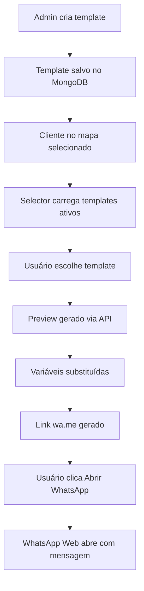

# Templates de Mensagens WhatsApp

Sistema de templates para facilitar o contato com clientes via WhatsApp no Felssner Representações.

## 🎯 Funcionalidades

- **CRUD de Templates**: Criar, editar, listar e excluir templates de mensagens
- **Tipos de Abordagem**: 7 gatilhos diferentes (primeiro contato, reativação, campanhas, etc.)
- **Variáveis Dinâmicas**: Placeholders que são substituídos com dados reais do cliente
- **Variações de Mensagem**: Até 3 variações por template para evitar repetição
- **Integração com Cliente**: Seletor de templates no painel do cliente
- **Preview em Tempo Real**: Visualize a mensagem final antes de enviar
- **Link WhatsApp**: Geração automática de link wa.me

## 📁 Estrutura de Arquivos

```
server/
  api/v1/
    whatsapp-templates/
      index.get.ts         # Listar templates
      index.post.ts        # Criar template
      [id].patch.ts        # Atualizar template
      [id].delete.ts       # Deletar template
    whatsapp/
      preview.post.ts      # Gerar preview de mensagem
  utils/
    whatsapp.ts            # Funções utilitárias

app/
  components/
    NWhatsAppButton.vue              # Botão base WhatsApp
    WhatsAppTemplateSelector.vue     # Seletor de templates
  composables/
    useWhatsAppTemplates.ts          # CRUD de templates
    useWhatsAppLink.ts               # Geração de preview/link
  types/
    schemas.ts                       # Schemas Zod (WhatsAppTemplate, etc.)

layers/admin/app/pages/admin/
  whatsapp-templates/
    index.vue            # Lista de templates
    [id].vue             # Criar/editar template

scripts/
  seed_whatsapp_templates.ts         # Seed com 7 templates iniciais
```

## 🚀 Como Usar

### 1. Seed Inicial

Execute o seed para criar 7 templates prontos:

```bash
pnpm tsx scripts/seed_whatsapp_templates.ts
```

### 2. Gerenciar Templates

Acesse o menu admin:

- **URL**: `/admin/whatsapp-templates`
- Criar novos templates
- Editar templates existentes
- Ativar/desativar templates
- Adicionar até 3 variações por template

### 3. Usar com Clientes

No painel do cliente (ClientSidePanel):

1. Selecione um template no dropdown
2. Escolha uma variação (se houver)
3. Veja o preview da mensagem com variáveis substituídas
4. Clique em "Abrir WhatsApp"
5. O link wa.me abre em nova aba com a mensagem pronta

## 🔧 Variáveis Disponíveis

| Variável                | Descrição              | Exemplo            |
| ----------------------- | ---------------------- | ------------------ |
| `{{nome}}`              | Nome do cliente        | "NAIH JOALHERIA"   |
| `{{atendente}}`         | Nome do vendedor       | "Marcus" (padrão)  |
| `{{empresa}}`           | Nome da empresa        | "NAIH JOALHERIA"   |
| `{{cidade}}`            | Cidade do cliente      | "Chapecó"          |
| `{{linha}}`             | Linha de produtos      | "alianças e joias" |
| `{{ultimaCompraData}}`  | Data última compra     | "10/02/2026"       |
| `{{ultimaCompraItens}}` | Itens da última compra | "Alianças de ouro" |

## 📝 Tipos de Gatilho (Trigger Types)

1. **FIRST_CONTACT** 🤝 - Primeiro contato com prospecto
2. **LAST_SALE_90D** 📦 - Última venda até 90 dias atrás
3. **LAST_CONTACT_180D** 📞 - Último contato até 180 dias atrás
4. **REACTIVATION** 🔄 - Reativação de cliente inativo
5. **DATE_CAMPAIGN** 📅 - Campanhas sazonais (Dia das Mães, etc.)
6. **BUDGET_FOLLOWUP** 💰 - Follow-up de orçamento enviado
7. **RELATIONSHIP** 🤝 - Relacionamento sem venda direta

## 🎨 Exemplo de Template

```
Nome: Primeiro Contato - Formal
Tipo: FIRST_CONTACT
Mensagem:
  Olá! Sou {{atendente}} da Felssner Representações.
  Trabalhamoscom {{linha}} de alta qualidade.
  Posso te enviar nosso catálogo?

Variação 1:
  Oi! Aqui é {{atendente}} da Felssner.
  Temos {{linha}} que podem interessar sua loja.
  Gostaria de conhecer?
```

## 🔄 Fluxo Completo



## 📊 Collection MongoDB

**Collection**: `whatsappTemplates`

```typescript
{
  _id: ObjectId
  name: string
  triggerType: string
  isActive: boolean
  messageBody: string
  variations: string[]
  language: string
  variablesAllowed: string[]
  createdAt: Date
  updatedAt: Date
  createdBy?: string
}
```

**Índices**:

- `triggerType_1`
- `isActive_1`

## 🛠️ Manutenção

### Adicionar novo tipo de gatilho

1. Adicionar em `TriggerTypeSchema` (app/types/schemas.ts)
2. Adicionar label em `getTriggerLabel()` (index.vue)
3. Adicionar opção no select ([id].vue)
4. Criar seed com exemplos (opcional)

### Adicionar nova variável

1. Adicionar extração em `extractClientVariables()` (server/utils/whatsapp.ts)
2. Documentar no README
3. Adicionar no array `variablesAllowed` dos novos templates

## ✅ Checklist de Implementação

- [x] Schemas Zod
- [x] Utils de WhatsApp (normalização, resolver vars, build link)
- [x] 5 endpoints da API
- [x] 2 composables
- [x] 3 componentes (NWhatsAppButton, selector, preview modal)
- [x] 2 páginas admin (index e [id])
- [x] Script de seed
- [x] Integração no menu
- [x] Integração no ClientSidePanel
- [x] Templates iniciais criados (7)

## 📞 Contato

Sistema desenvolvido para Felssner Representações seguindo padrões do AGENTS.md.
